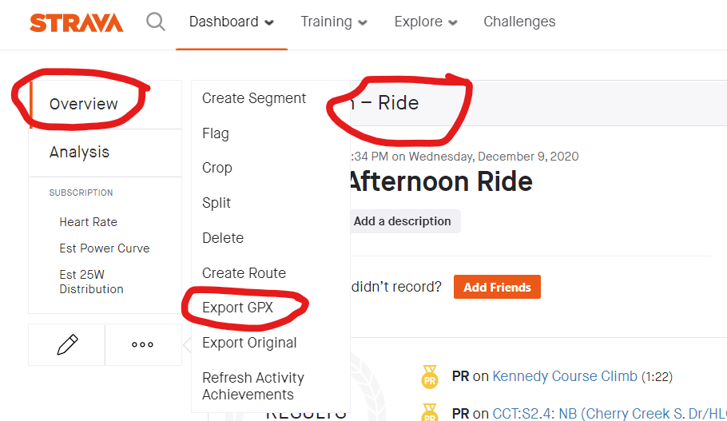

##  Getting Data from Strava

For this exercize, I'm using GPX data from Strava.  Strava's free account allows you to download/export GPX-formatted data.

### Step 1: Log into Strava's Website

This is self-explanatory

### Step 2: Export Strava Datasets

For each exercise activity you do, you can export it's GPX-formatted data as shown in the screenshot below...

### Overview of GPX Data

GPX data is in XML format.  It's a highly descriptive, easily parsible format. 

    <?xml version="1.0" encoding="UTF-8"?>
    <gpx creator="StravaGPX iPhone" xmlns:xsi="http://www.w3.org/2001/XMLSchema-instance" xsi:schemaLocation="http://www.topografix.com/GPX/1/1 http://www.topografix.com/GPX/1/1/gpx.xsd" version="1.1" xmlns="http://www.topografix.com/GPX/1/1">
     <metadata>
      <time>2020-11-20T00:03:18Z</time>
     </metadata>
     <trk>
      <name>Afternoon Ride</name>
      <type>1</type>
      <trkseg>
       <trkpt lat="39.6271650" lon="-104.8685840">
        <ele>1713.8</ele>
        <time>2020-11-20T00:03:18Z</time>
       </trkpt>
       <trkpt lat="39.6271630" lon="-104.8686280">
        <ele>1713.8</ele>
        <time>2020-11-20T00:03:19Z</time>
        </trkpt>

Each GPS entry is a "track-point" (i.e. `<trkpt>`).  The entry includes latitude, longitude, elevation, and timestamp.

## TBD:  Automatically use Strava's Rest API

This is still a work in progress.